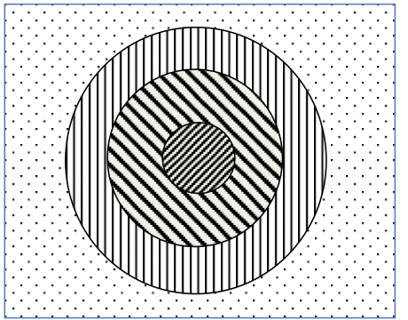

VisIVO Filter
=============
VisIVO Filter is a component that converts data from a VisIVO Binary Table (VBT) into a new one or can create a Volume from a table.

To get a general help:

.. code-block:: console

    $ VisIVOFilter --help

To get a specific operation help:

.. code-block:: console

    $ VisIVOFilter --op <operation> --help

To run the operation:

.. code-block:: console

    $ VisIVOFilter --op <operation> <parameters> [--file] InputFile

.. note:: The InputFile must be a valid VBT. :file:`InputFile.bin` and :file:`InputFile.bin.head` must exist.

Global options
--------------
The following option can be given on any filter operation.

--memsizelimit <percentage>
    This option reduces the memory request of the percentage value given with this option.
    
    Depending on the specific filter request and on the system where VisIVOFilter runs, the allocated memory could exceed the available size and the application could be aborted or can use a significant portion of the system swap area, with a dramatic lost of performance.
    
    This parameter can be given to reduce the allocated space avoiding this effect.

    A Warning message will be given when this option is used. The allowed value is a float greater than 0. and lower than 95.0.
--history
    Create an XML file which contains the history of operations performed.
--historyfile <file.xml>
    Change output history file name. Default: :file:`hist.xml`.

Parameter file
--------------
Alternatively, to run the operation with options specified in the parameter file:

.. code-block:: console

    $ VisIVOFilter <parameterFile>

Lines starting with # are comments.

An example of this file is the following (for the randomizer filter):

.. code-block::

    op=randomizer
    #memsizelimit=30        This is a commented line
    perc=50.0
    iseed=1
    out=VBT_rand.bin
    file=VBT.bin

Operations
----------
The following operations are available:

.. contents::
    :local:

Add ID
^^^^^^
This operation adds a new column with a sequence of Ids in the input data table.

Usage:

.. code-block:: console

    $ VisIVOFilter --op addId [--outcol col_name] [--start start_number] [--file] inputFile.bin

Options:

--outcol
    Column name of the new id column. Default name is Id.
--start
    Starting Id. Default value is 0. Only an int value can be given.
--file
    Input table filename.

Append
^^^^^^
This operation creates a new table appending data from a list of existing tables. Append Filter can append up to 100 tables with the same number of Columns.

Usage:

.. code-block:: console

    $ VisIVOFilter --op append [--out filename_out.bin] [--filelist] table_list.txt

Options:

--out
    Output table filename. Default name is given.
--filelist
    Input filename containing the table list.

:file:`table_list.txt` is a file that contains a list of valid table names. The ".bin" extension is automatically added if the listed filename does not contain it.

.. code-block::

    tab1
    tab2
    tab3

.. note:: The column names are copied from the first table. An error is given if tables contain different numbers of columns.

Cartesian2Polar
^^^^^^^^^^^^^^^
This operation creates three new fields in a data table as the result of the spherical polar transformation of three existing fields.

Usage:

.. code-block:: console

    $ VisIVOFilter --op cartesian2polar --field X Y Z [--append] [--outcol rho theta phi] [--out filename_out.bin] [--file] inputFile.bin

Options:

--field
    Three valid columns name used as cartesian coordinates.
--append
    No new table will be created. The original table will have new fields. Default options: a new table with only the new field is produced.
--outcol
    Column name of the new fields. Default names are: rho, theta and phi.
--out
    Name of the new table. Default name is given. Ignored if --append is specified.
--file
    Input table filename.

Change Column name
^^^^^^^^^^^^^^^^^^
This operation changes the column names in an existing table.

Usage:

.. code-block:: console

    $ VisIVOFilter --op changecolname --field column_names --newnames new_names [--file] inputFile.bin

Options:

--field
    Valid columns names.
--newnames
    Valid new columns names.
--file
    Input table filename.

Cut
^^^
This operation fixes column values included in an interval to a threshold.

Usage:

.. code-block:: console

    $ VisIVOFilter --op cut [--field columns_list] --limits limitsfile.txt [--threshold value] [--operator AND/OR] [--out filename_out.bin] [--file] inputFile.bin

The :file:`limitsfile.txt` file must have the following structure. A valid column name and an interval indicating the extraction limits:

.. code-block::

    X 20.0 30.0
    Y 10.0 20.0
    Z 0.0 10.0

.. note:: The unlimited word can be used to indicate the infinite value.

Options:

--field
    It is a valid columns name list to be reported in the new table. Default: all columns will be reported.
--limits
    A file that has three columns: a valid column name and an interval indicating the extraction limits.
--threshold
    Value to be used to cut data. Default value is 0.
--operator
    Limits on all fields listed in the --limits option file are combined by default with logic AND operator. If this option is given with the OR value the field limits are combined with logic OR operator.
--out
    Output table filename. Default name is given.
--file
    Input table filename.

The example file and the following command:

.. code-block:: console

    $ VisIVOFilter --op cut --field A B C --limits limitsfile.txt --operator AND --out filename_out.bin --threshold 1.0 --file inputFile.bin

produce a new table that contains all the data points and columns of the input table. In any row where :math:`X \in [20.0, 30.0]` AND :math:`Y \in [10.0, 20.0]` AND :math:`Z \in [0.0, 10.0]` the fields A B and C will be changed with the threshold value 1.0. Other fields will not be changed.

Decimator
^^^^^^^^^
This operation creates a sub-table as a regular subsample from the input table.

Usage:

.. code-block:: console

    $ VisIVOFilter --op decimator --skip step [--list parameters] [--out filename_out.bin] [--file] inputFile.bin

Options:

--skip
    An integer that represent the number of elements to skip.
--list
    Valid columns names of the input table. Default: all columns are included.
--out
    Output table filename. Default name is given.
--file
    Input table filename.

Values are extracted in a regular sequence, skipping step element every time. The skip value is an integer number > 1 and represents the number of skipped values. The output table must fit the available RAM.

Extraction
^^^^^^^^^^
This operation creates a new table from a sub-box or a sphere.

.. note:: Operation not allowed on volumes.

Usage:

.. code-block:: console

    $ VisIVOFilter --op extraction --geometry geometry.txt [--out filename_out.bin] [--file] inputFile.bin

Options:

--geometry
    The :file:`geometry.txt` file must have four rows and two columns. The first three rows must have a valid column name and a value for each column that indicates the extraction coordinates. The fourth field means the extraction mode and the sub-volume size:

    * RADIUS, a sphere centered in the given values will be extracted;
    * CORNER, a rectangular region having the lower corner at the given values will be extracted;
    * BOX, a rectangular region centered in the given values will be extracted.
--out
    Output table filename. Default name is given.
--file
    Input table filename.

Geometry file examples:

.. code-block::

    X 25.0
    Y 25.0
    Z 25.0
    RADIUS 5.0

.. code-block::

    X 0.0
    Y 0.0
    Z 0.0
    CORNER 10.0

.. code-block::

    X 25.0
    Y 25.0
    Z 25.0
    BOX 5.0

Extract List
^^^^^^^^^^^^
This operation creates a new table from an input table with the elements (rows) listed in a given multi-list file. A multi-list is given in ascii or binary format (unsigned long long int).

.. note:: Operation not allowed on volumes.

Usage:

.. code-block:: console

    $ VisIVOFilter --op extractlist --multilist filename_list [--binaryint] [--asciilist] [--numberlists NL] [--listelements N0] [--onelist] [--out filename_out.bin] [--file] inputFile.bin

Options:

--multilist
    The multi-list file name.
--binaryint
    If this parameter is specified the multi-list file is in binary int. Defalt format: binary unsigned long long int.
--asciilist
    If this parameter is specified the multi-list file is an ascii text.
--numberlists
    The multi-list file format is just a sequence of NL lists specified in this option. Each list starts with the number of elements in the list.
--listelements
    The multi-list file format is just a sequence of NL lists. Each list has the same number of N0 elements. This option requires that the --numberlists option is specified, otherwise it is ignored.
--onelist
    If this option is given, the multi-list file is considered as only one list. Each element is the ID of the particle to be extracted. The --numberlists and --listelements options will be ignored.
--out
    Name of the new table. Default name is given.
--file
    Input table filename.

The multi-list has the following structure:

.. code-block:: none

    Number NL of lists
    NL sequences:
        1) Number N0 of elements in the list,
        2) N0 elements

Option can be given to provide the NL number. In this case the multi-list file must not contain this information.
Option can be given to provide the N0 number. In this case the multi-list file must not contain this informations but it is a multi-list, each list must contain N0 elements.

If the onelist option is given the multi-list file is only a sequence of rows to be extracted.

Multi-list ascii file example:

.. code-block::

    2       # N of lists
    4       # N of elments of the 1st list
    1       # Start sequence of the 1st list
    7
    27
    100     # End of the 1st list
    6       # N of elments of the 2nd list
    4
    8
    15
    16
    23
    42

Grid2Point
^^^^^^^^^^
This operation distributes a volume property to a point data set on the same computational domain using a field distribution (CIC/NGP/TSC algorithm) on a regular mesh. CIC is the default adopted algorithm. The Cell geometry is considered only to compute the cell volume value in this operation.

This filter produces a new table or adds a new field to the input table.

The operation performs the following:

1. It loads a volume (input volume data table) and a table with a point distribution in the same volume;
2. It computes, using a CIC or NGP or TSC algorithm, a value (assumed density) for each data point, considering the cells value where the point is spread. The grid points density values are multiplied for the cell volume and assigned to the point. If the density option is given the cell volume is assumed =1;
3. It saves the property in a new table or adds the field to the original input table.

Usage:

.. code-block:: console

    $ VisIVOFilter --op grid2point --points x_col y_col z_col [--field column_name] [--density] [--append] [--out filename_out.bin] [--outcol col_name] [--tsc] [--ngp] --volume inputVolmeData.bin [--gridOrigin xg0 xg1 xg2] [--gridSpacing sg0 sg1 sg2] [--box length] [--periodic] [--file] inputFile.bin

Options:

--points
    Columns to be assumed for points coordinates.
--field
    Valid Volume Column Name. Default value is the first column name.
--density
    Cell volume is not considered (cell volume=1).
--append
    No new table will be created. The original table will have the new field.
--out
    Name of the new table. Default name is given. Ignored if --append is specified.
--outcol
    Column name of the new field.
--tsc
    The TSC algorithm is adopted.
--ngp
    The NGP algorithm is adopted.
--volume
    Input data volume filename (a VisIVO Binary Table).
--gridOrigin
    It specifies the coordinate of the lower left corner of the grid. Default values are assumed from the box of :file:`inputFile.bin`.
--gridSpacing
    It specifies the length of each cell dimension in arbitrary unit. This parameter is ignored if the box option is given. Default values are assumed from the box of :file:`inputFile.bin`.
--box
    It specifies the length of a box. Default value is assumed from the box of :file:`inputFile.bin` if the gridSpacing option is not given.
--periodic
    Applies a periodical boundary condition.
--file
    Input table filename with point distribution.

Include
^^^^^^^
This operation produces a new table or adds a new field to the input table. Points inside the sphere (given with center and radius) will have the value invalue, otherwise outvalue.

Usage:

.. code-block:: console

    $ VisIVOFilter --op include --center x_coord y_coord z_coord --radius radius [--field x_col y_col z_col] [--append] [--out filename_out.bin] [--outcol col_name] [--outvalue outvalue] [--invalue invalue] [--file] inputFile.bin

Options:

--center
    Coordinates of the sphere center.
--radius
    Radius of the sphere.
--field
    Three valid columns names. Default values are the first three columns.
--append
    No new table will be created. The original table will have the new field.
--out
    Name of the new table. Default name is given. Ignored if --append is specified.
--outcol
    Column name of the new field.
--outvalue
    Value given to points outside the sphere. Default value is 0.
--invalue
    Value given to points inside the sphere. Default value is 1.
--file
    Input table filename.

Interpolate
^^^^^^^^^^^
This operation creates new tables from two existing data tables (mainly used to produce intermediate frames of a dynamical evolution).

Usage:

.. code-block:: console

    $ VisIVOFilter --op interpolate [--field columns_name] [--numbin numberbin] [--periodic] [--interval from to] [--out filename_out] --infiles file_start.bin file_end.bin

.. note:: The two table must have the same structure. The infiles tables must have the listed columns in the --field option in the same corresponding order. The input tables must have the same number of rows and the interpolated elements are considered in the same order. No index is currently supported.

Options:

--field
    A valid list of columns names that must exist on both input tables. Default: all columns in infile files are considered.
--numbin
    Is the number of bins between the starting and ending input files or the interval given in the --interval option. The default value is 10. The number of created tables is equal to numberbin-1.
--periodic
    Applies a periodical boundary condition.
--interval
    VisIVO assumes a distance of 1.0 between the starting frame and ending frame. This option produces the intermediate frames (tables) in a subinterval between the two input frames.
    
    The value 0.5 is the medium point of the interval. If the from value is lower than 0.0 it is considered 0.0. If the to value is greater than 1.0 it is considered 1.0. If the from value is equal to to value the operation is not performed. Default value from=0.0 to=1.0
--out
    It is the root name of the new tables. The default name is given. The new name is given by the :file:`filename_out#.bin` where # is the number of created tables.
--infiles
    It contains the names of the input tables of the interpolation process.

Math Operations
^^^^^^^^^^^^^^^
The operation creates a new field in a data table as the result of a mathematical operation between the existing fields.

Usage:

.. code-block:: console

    $ VisIVOFilter --op mathop [--expression math_expression.txt] [--compute <<expression>>] [--append] [--outcol col_name] [--out filename_out.bin] [--file] filename.bin

Options:

--expression
    A file with only one row having any valid mathematical expression with Valid Column names. Ignored if compute option is given.
--compute
    A valid mathematical expression with Valid Column names. The expression must start with << and finish with >> characters. It has the priority on the expression option.
    
    The expression must contain the escape character control for the << and >> symbols and the parentheses. For example, to evaluate :math:`(A/B) * C` the correct syntax will be ``–-compute \<\<\(A/B\)*C\>\>``.
    
    .. note:: The << , >> and escape characters must not be given if the parameter file is used.
--append
    No new table will be created. The original table will have the new field. Default options: a new table with only the new field is produced.
--outcol
    Column name of the new field
--out
    Output table filename. Default name is given. Ignored if --append is specified.
--file
    Input table filename.

:file:`math_expression.txt` is a file that contains only one row with a mathematical expression, for example:

.. code-block::

    sqrt(VelX*VelX+VelY*VelY+VelZ*VelZ)

Arithmetic float expressions can be created from float literals, variables or functions using the following operators in this order of precedence:

+----------------------------+------------------------------------------------------------------------------------+
| ()                         | expressions in parentheses first                                                   |
+----------------------------+------------------------------------------------------------------------------------+
| A unit                     | a unit multiplier (if one has been added) exponentiation (A raised to the power B) |
+----------------------------+------------------------------------------------------------------------------------+
| A^B                        | exponentiation (A raised to the power B)                                           |
+----------------------------+------------------------------------------------------------------------------------+
| -A                         | unary minus                                                                        |
+----------------------------+------------------------------------------------------------------------------------+
| !A                         | unary logical not (result is 1 if int(A) is 0, else 0)                             |
+----------------------------+------------------------------------------------------------------------------------+
| A*B A/B A%B                | multiplication, division and modulo                                                |
+----------------------------+------------------------------------------------------------------------------------+
| A+B A-B                    | addition and subtraction                                                           |
+----------------------------+------------------------------------------------------------------------------------+
| A=B A!=B A<B A<=B A>B A>=B | comparison between A and B (result is either 0 or 1)                               |
+----------------------------+------------------------------------------------------------------------------------+
| A&B                        | result is 1 if int(A) and int(B) differ from 0, else 0                             |
+----------------------------+------------------------------------------------------------------------------------+
| A|B                        | result is 1 if int(A) or int(B) differ from 0, else 0                              |
+----------------------------+------------------------------------------------------------------------------------+

Since the unary minus has higher precedence than any other operator, the following expression is valid: ``x*-y``.

The comparison operators use an epsilon value, so expressions which may differ in very least-significant digits should work correctly.

The following operations can be used:

+------------+-------------------------------------------------------------------------------------------------------------------------------------------+
| abs(A)     | Absolute value of A. If A is negative, returns -A otherwise returns A.                                                                    |
+------------+-------------------------------------------------------------------------------------------------------------------------------------------+
| acos(A)    | Arc-cosine of A. Returns the angle, measured in radians, whose cosine is A.                                                               |
+------------+-------------------------------------------------------------------------------------------------------------------------------------------+
| acosh(A)   | Same as acos() but for hyperbolic cosine.                                                                                                 |
+------------+-------------------------------------------------------------------------------------------------------------------------------------------+
| asin(A)    | Arc-sine of A. Returns the angle, measured in radians, whose                                                                              |
|            | sine is A.                                                                                                                                |
+------------+-------------------------------------------------------------------------------------------------------------------------------------------+
| asinh(A)   | Same as asin() but for hyperbolic sine.                                                                                                   |
+------------+-------------------------------------------------------------------------------------------------------------------------------------------+
| atan(A)    | Arc-tangent of (A). Returns the angle, measured in radians, whose tangent is (A).                                                         |
+------------+-------------------------------------------------------------------------------------------------------------------------------------------+
| atan2(A,B) | Arc-tangent of A/B. The two main differences to atan() is                                                                                 |
|            | that it will return the right angle depending on the signs of A and B                                                                     |
|            | (atan() can only return values between -pi/2 and pi/2), and that the return                                                               |
|            | value of pi/2 and -pi/2 are possible.                                                                                                     |
+------------+-------------------------------------------------------------------------------------------------------------------------------------------+
| atanh(A)   | Same as atan() but for hyperbolic tangent.                                                                                                |
+------------+-------------------------------------------------------------------------------------------------------------------------------------------+
| ceil(A)    | Ceiling of A. Returns the smallest integer greater than A. Rounds up to the next higher integer.                                          |
+------------+-------------------------------------------------------------------------------------------------------------------------------------------+
| cos(A)     | Cosine of A. Returns the cosine of the angle A, where A is measured in radians.                                                           |
+------------+-------------------------------------------------------------------------------------------------------------------------------------------+
| cosh(A)    | Same as cos() but for hyperbolic cosine.                                                                                                  |
+------------+-------------------------------------------------------------------------------------------------------------------------------------------+
| cot(A)     | Cotangent of A (equivalent to 1/tan(A)).                                                                                                  |
+------------+-------------------------------------------------------------------------------------------------------------------------------------------+
| csc(A)     | Cosecant of A (equivalent to 1/sin(A)).                                                                                                   |
+------------+-------------------------------------------------------------------------------------------------------------------------------------------+
| exp(A)     | Exponential of A. Returns the value of e raised to the power A where e is the base of the natural logarithm, i.e. the non-repeating value |
|            | approximately equal to 2.71828182846.                                                                                                     |
+------------+-------------------------------------------------------------------------------------------------------------------------------------------+
| floor(A)   | Floor of A. Returns the largest integer less than A. Rounds down to the                                                                   |
|            | next lower integer.                                                                                                                       |
+------------+-------------------------------------------------------------------------------------------------------------------------------------------+
| if(A,B,C)  | If int(A) differs from 0, the return value of this function is B, else C. Only                                                            |
|            | the parameter which needs to be evaluated is evaluated, the other                                                                         |
|            | parameter is skipped; this makes it safe to use eval() in them.                                                                           |
+------------+-------------------------------------------------------------------------------------------------------------------------------------------+
| int(A)     | Rounds A to the closest integer. 0.5 is rounded to 1.                                                                                     |
+------------+-------------------------------------------------------------------------------------------------------------------------------------------+
| log(A)     | Natural (base e) logarithm of A.                                                                                                          |
+------------+-------------------------------------------------------------------------------------------------------------------------------------------+
| log10(A)   | Base 10 logarithm of A.                                                                                                                   |
+------------+-------------------------------------------------------------------------------------------------------------------------------------------+
| max(A,B)   | If A>B, the result is A, else B.                                                                                                          |
+------------+-------------------------------------------------------------------------------------------------------------------------------------------+
| min(A,B)   | If A<B, the result is A, else B.                                                                                                          |
+------------+-------------------------------------------------------------------------------------------------------------------------------------------+
| sec(A)     | Secant of A (equivalent to 1/cos(A)).                                                                                                     |
+------------+-------------------------------------------------------------------------------------------------------------------------------------------+
| sin(A)     | Sine of A. Returns the sine of the angle A, where A is measured in                                                                        |
|            | radians.                                                                                                                                  |
+------------+-------------------------------------------------------------------------------------------------------------------------------------------+
| sinh(A)    | Same as sin() but for hyperbolic sine.                                                                                                    |
+------------+-------------------------------------------------------------------------------------------------------------------------------------------+
| sqrt(A)    | Square root of A. Returns the value whose square is A.                                                                                    |
+------------+-------------------------------------------------------------------------------------------------------------------------------------------+
| tan(A)     | Tangent of A. Returns the tangent of the angle A, where A is measured in                                                                  |
|            | radians.                                                                                                                                  |
+------------+-------------------------------------------------------------------------------------------------------------------------------------------+
| tanh(A)    | Same as tan() but for hyperbolic tangent.                                                                                                 |
+------------+-------------------------------------------------------------------------------------------------------------------------------------------+

Merge
^^^^^
This operation creates a new table from two or more existing data tables. Up to 100 tables can be merged. Volumes can be merged but they must have the same geometry.

Usage:

.. code-block:: console

    $ VisIVOFilter --op merge  [--size HUGE/SMALLEST] [--pad value] [--out filename_out.bin] [--filelist] tab_selection_file.txt

Options:

--size
    Produce a new table having the size of the smallest (or larger) table. Default option: SMALLEST.
--pad
    Pad the table rows of smaller table with the given value if HUGE size is used. Default value: 0.
--out
    Output table filename. Default name is given.
--filelist
    Input filename containing the table list.

The :file:`tab_selection_file.txt` is a file that contain a list of tables and valid columns. Wildcard "*" means all the columns of the given table. An example file is the following:

.. code-block::

    tab1.bin Col_1
    tab1.bin Col_2
    tab5.bin Col_x
    tab4.bin *

This file a new table having columns Col_1 and Col_2 from :file:`tab1.bin`, Col_x from :file:`tab5.bin` and all the columns of :file:`tab4.bin`.

Module
^^^^^^
This operation creates a new table (or a new field) computing the module of three fields of the input data table.

Usage:

.. code-block:: console

    $ VisIVOFilter --op module --field parameters [--append] [--outcol colname] [--out filename_out.bin] [--file] inputFile.bin

Options:

--field
    Three valid columns name lists used to compute the module.
--append
    No new table will be created. The original table will have the new field. Default options: a new table with only the new field is produced.
--outcol
    Column name of the new field.
--out
    Name of the new table. Default name is given. Ignored if --append is specified.
--file
    Input table filename

Example:

.. code-block:: console

    $ VisIVOFilter --op module --field x y z --outcol Module --append --file inputFile.bin

This command appends a new field named Module to the :file:`inputFile.bin` file that represents the module of the fields x, y and z: :math:`\sqrt{x^2+y^2+z^2}`.

Multi Resolution
^^^^^^^^^^^^^^^^
This operation creates a new VBT as a random subsample from the input table, with different resolutions.

Starting from a fixed position, that represents the center of inner sphere, concentric spheres are considered. Different level of randomization can be given, creating more detail table in the inner sphere and lower detail in the outer regions, or vice versa. The region that is external to the last sphere represents the background.

.. note:: Operation not yet allowed on volumes.

Usage:

.. code-block:: console

    $ VisIVOFilter --op mres --points x_col y_col z_col [--pos values] [--geometry layer_file.txt] [--background value] [--out filename_out.bin] [--file] inputFile.bin

Options:

--points
    Columns to be assumed for points coordinates.
--pos
    Camera point coordinates. Default value is the center of the domain.
--geometry
    A file that contains a radius and a randomization value: 1.0 all values included; 0.1 means 1 per cent of values included in the layer. Each row of this file determine a layer. A default geometry is created with three spheres and different levels of randomization, depending on the input dataset.
--background
    A randomizator value for points outside the geometry. Default value is maximum 100000 values from input VBT.
--out
    Name of the new table. Default name is given.
--file
    Input table filename.

For example, the following command and file:

.. code-block:: console

    $ VisIVOFilter --op mres --points X Y Z --pos 10.0 10.0 10.0 --geometry layer.txt --background 0.0001 --out pos_layer.bin --file pos.bin

.. code-block::

    5.0 1.0
    10.0 0.1
    30.0 0.01

produce a new table. 

The geometry file  in this example, has the following values:

* 5.0 is the radius of the inner sphere. The 1.0 is the percentage of randomization inside the inner sphere: all points that are inside the inner sphere will be reported in the output VBT.
* 10.0 is the radius of the second sphere. The value 0.1 is the percentage of randomization inside this sphere: only 10% of points that are inside this sphere will be reported in the output VBT.
* 30.0 is the radius of the last sphere. The value 0.01 is the percentage of randomization inside this sphere: only 1% of points that are inside this sphere will be reported in the output VBT. 

Poca
^^^^
This operation produces two tables. The first one contains scattering points and angles. The second is a volume: each mesh point contains the square sum of the scattering angle.

The input file must be the output from the muportal importer with 10 column: Event number, X_A Y_B X_C Y_D X_E Y_F X_G Y_H (8 values coordinates in cm at the planes of the system), Energy pulse in GeV/C.

Usage:

.. code-block:: console

    $ VisIVOFilter --op poca [--resolution x_res y_res z_res] [--dimvox voxel_size] [--trackplanedist distance] [--innerdist distance] [--outpoints points.bin] [--outvol vol.bin] [--file] inputFile.bin

Options:

--resolution
    3D mesh size in cm. Default value 600 300 300.
--dimvox
    Cubic voxel dimension in cm. Default value 10.
--trackplanedist
    Distance in cm between planes 1 - 2 and planes 3 - 4. Default value 100.
--innerdist
    Distance in cm between planes 3 - 4. Default value 300.
--outpoints
    Name of the new table containing poca points.
--outvol
    Name of the new table containing the volume having the theta square value sum in each voxel.
--file
    Input table filename.

For example, the following command:

.. code-block:: console

    $ VisIVOFilter --op poca --resolution 600 300 300 --dimvox 10 --outpoins points --outvol vol.bin --file inputFile.bin

Produces a points file VBT with scatter points inside the volume of reference a 60x30x30 and a multi-volume.

The input file is a VBT with 10 columns that represent: Event number, X_A Y_B X_C Y_D X_E Y_F X_G Y_H (8 values coordinates in cm at the planes of the system), Pulse energy in GeV/C.

The filter gives the track Id and the Energy of each points X Y Z. This is the output of the Importer “muportal”.
It produces two tables (:file:`points.bin` and :file:`vol.bin`) containing:

* The points of the POCA algorithm and angles with the following fields: event number, X, Y and Z, theta, theta square, energy.
* A multi-volume (7 volumes) with cell resolution/dimvox on each directiom. Each voxel contatins quantities of all scattering points inside the voxel: sum of the theta (scattering angle), sum of theta square, theta square average, sigma, error and number of scatter points.

Point Distribute
^^^^^^^^^^^^^^^^
This operation creates a table which represents a volume from selected fields of the input table that are distributed using NGP, CIC (default) or TSC algorithm. The filter produces (by default) a density field: the field is distributed and divided for the cell volume.

Usage:

.. code-block:: console

    $ VisIVOFilter --op pointdistribute  --resolution x_res y_res z_res --points x_col y_col z_col [--field column_names] [--constant value] [--nodensity] [--avg] [--out filename_out.bin] [--tsc] [--ngp] [--gridOrigin xg0 xg1 xg2] [--gridSpacing sg0 sg1 sg2] [--box length] [--periodic] [--file] inputFile.bin

Options:

--resolution
    3D mesh size.
--points
    Columns to be assumed for points coordinates.
--field
    Valid columns name list to be distributed in the grid.
--constant
    Assign a constant value to all points, to be distributed in the grid. Ignored if field option is given. Default value is 1.0 for all points.
--nodensity
    Overrides the default behavior. The field distribution is not divided for the cell volume.
--avg
    Distributes the first field on the volume grid and computes the arithmetic average value on each cell of the first field. The output volume table will have three fields. For each cell there will be: the number of total elements in the cell (NumberOfElements), the sum of total field value (fieldSum), and the arithmetic average value (fieldAvg). Only the ngp algorithm will be applied.
--out
    Name of the new table. Default name is given.
--tsc
    The TSC algorithm is adopted.
--ngp
    The NGP algorithm is adopted.
--gridOrigin
    It specifies the coordinates of the lower left corner of the grid. Default values are assumed from the box of :file:`inputFile.bin`.
--gridSpacing
    It specifies the length of each cell dimension in the arbitrary unit. This parameter is ignored if the box option is given. Default values are assumed from the box of the :file:`inputFile.bin`.
--box
    It specifies the length of a box. Default values is assumed from the box of :file:`inputFile.bin` if the gridSpacing option is not given.
--periodic
    It specifies the box is periodic. Particles outside the box limits are considered inside on the other side.
--file
    Input table filename.

Point Property
^^^^^^^^^^^^^^
This operation assigns a property to each data point on the table.

The operation performs the following:

1. It creates a temporary volume using a field distribution (CIC algorithm) on a regular mesh. The temporary file will have the filename given in --out option + ``_tempPDOp.bin`` or :file:`_tempPDOp.bin`, and it is automatically cleaned by the operation itself;
2. It computes, with the same CIC algorithm, the property for each data point, considering the cells where the point is spread on the volume;
3. It saves the property in a new table or adds the field to the original input table. This operation cannot be applied to volumes.

Usage:

.. code-block:: console

    $ VisIVOFilter --op pointproperty --resolution x_res y_res z_res --points x_col y_col z_col [--field column_name] [--constant value] [--append] [--out filename_out.bin] [--outcol col_name] [--periodic] [--file] inputFile.bin

Options:

--resolution
    3D mesh size.
--points
    Columns to be assumed for points coordinates.
--field
    valid column name list to be distributed in the grid.
--constant
    Assign a constant value to all points, to be distributed in the grid. Ignored if field option is given. Default value is a 1.0 for all points.
--append
    the input table will contain the new field.
--out
    Name of the new table. Default name is given. Ignored if –append is given.
--outcol
    New field column name.
--periodic
    Applies a periodical boundary condition.
--file
    Input table filename.

For example, the following command:

.. code-block:: console

    $ VisIVOFilter --op pointproperty --resolution 16 16 16 --points X Y Z --field Mass --append --outcol distribute --file inputFile.bin

distributes the Mass field of points X Y Z and it produces a temporary volume. Then it calculates a new field representing the weight value of the nearest mesh-cells where the point is distributed using the same CIC algorithm.

Randomizer
^^^^^^^^^^
This operation creates a random subset from the original data table.

Usage:

.. code-block:: console

    $ VisIVOFilter --op randomizer --perc percentage [--field parameters] [--iseed iseed] [--out filename_out.bin] [--file] inputFile.bin

Options:

--perc
    Percentage (from 0.0 to 100.0) of the input file obtained in the output file.

    .. note:: Only the first decimal place is considered.

--field
    Valid columns names of the input table. Default: all columns are included.
--iseed
    Specify the seed for the random generation. Default value 0.
--out
    Output table filename. Default name is given.
--file
    Input table filename.

Select Columns
^^^^^^^^^^^^^^
This operation creates e new table using (or excluding) one or more fields of a data table. The default case produces the output table including only listed fields.

Usage:

.. code-block:: console

    $ VisIVOFilter --op selcolumns --field parameters [--delete] [--out filename_out.bin] [--file] inputFile.bin

Options:

--field
    Valid columns names of the input table. Default: all columns are included.
--delete
    Produce output table excluding only field listed in the --field option.
--out
    Output table filename. Default name is given.
--file
    Input table filename.

Select Fields
^^^^^^^^^^^^^
This operation creates a new table setting limits on one or more fields of a data table. Optionally it creates a list of elements satisfying the requested condition.

Usage:

.. code-block:: console

    $ VisIVOFilter --op selfield  --limits limitsfile.txt [--operator AND/OR] [--outlist list_filename] [--format uns/int/ascii] [--out filename_out.bin] [--file] inputFile.bin

Options:

--limits
    A file that has three columns: a valid column name and an interval indicating the extraction limits.
--operator
    Limits on all fields listed in --limits option file are combined by default with logic AND operator. If this option is given with OR value the field limits are combined with logic OR operator.
--outlist
    Output list filename containing the number of the elements satisfying the requested condition. Default name is given.
--format
    Data format in the outlist filename. Default value unsigned long long int.
--out
    Output table filename. Default name is given.
--file
    Input table filename.

The :file:`limitsfile.txt` file must have the following structure. A valid column name and an interval indicating the extraction limits:

.. code-block::

    X 20.0 30.0
    Y 10.0 20.0
    Z 0.0 10.0

This file produces a new table that contains all the data points of the input table (all columns will be reported) where :math:`X \in [20.0, 30.0]` AND :math:`Y \in [10.0, 20.0]` AND :math:`Z \in [0.0, 10.0]`.

.. note:: The unlimited word can be used to indicate the infinite value.

Show Table
^^^^^^^^^^
Produce an ASCII table with selected field of the first number of rows as specified in the --numrows parameter.

Usage:

.. code-block:: console

    $ VisIVOFilter --op showtable [--field column_name] [--numrows num_of_rows] [--rangerows fromRow toRow] [--width format_width] [--precision format_precision] [--out filename_out.txt] [--file] inputFile.bin

Options:

--field
    Valid columns names. Default value of all columns will be reported.
--numrows
    Number of rows in the ASCII output file. Default value is equal to the number of rows of the input table.
--rangerows
    Rows range of the inputFile that will be reported in the ASCII output file. Default range is equal to all the rows of the input table. It is ignored if numrows is specified.
--width
    Field width in the ASCII output file. Default value is given.
--precision
    Field precision in the ASCII output file. Default value is given.
--out
    Output ASCII filename. Default name is given.
--file
    Input table filename.

Show Volume
^^^^^^^^^^^
This operation writes on an output ascii file, the volume cells and their values that satisfy given limits.

Usage:

.. code-block:: console

    $ VisIVOFilter --op showvol [--field column_name] --limits limits.txt [--operator AND/OR] [--numcells value] [--out filename_out.txt] [--file] inputFile.bin

The :file:`limits.txt` file must have the following structure: a valid column name and an interval that indicate the limits.

.. code-block::

    density 20.0 30.0
    mass 10.0 20.0

.. note:: The keyword unlimited can be used to indicate the infinite value.

Options:

--field
    Valid columns names. Default value of ALL columns will be reported.
--limits
    A file that has three columns: a valid column name and an interval that indicate the limits.
--operator
    Limits on all field listed in the --limits option file are combined by default with logic AND operator. If this option is given with OR value the field limits are combined with logic OR operator.
--numcells
    Set the maximum number of cells that will be reported in the output.
--out
    Output ascii filename. Default name is given.
--file
    Input table filename.

The example file and the following command:

.. code-block:: console

    $ VisIVOFilter --op showvol --field density mass --limits limitsfile.txt --operator AND --out filename_out.txt --file inputFile.bin

produce an ascii file that lists all cells where limits are satisfied.

The output ascii file will report on each row the cell (X, Y and Z) and the field value.

Sigma Contours
^^^^^^^^^^^^^^
This operation creates a new table where one or more fields of a data table have values within (or outside) N sigma contours. For the selected fields, the filter prints in the stdout the average and the sigma values of the distributions.

.. note:: The filter can be applied on fields that have a Gaussian distribution. 

Usage:

.. code-block:: console

    $ VisIVOFilter --op sigmacontours [--nsigma nOfSigma] [--field columns_list] [--exclude] [--allcolumns] [--out filename_out.bin] [--file] filename.bin

Options:

--nsigma
    Number of sigma used in the variable selection. Default value: 1 sigma countour.
--field
    List of columns that must have values within N sigma contours. Default value: all the columns in the table.
--exclude
    Values outside N sigma contours will be reported.
--allcolumns
    All columns of the input tables will be saved in the output table. But only the corresponding rows for the --field selected columns are reported.
--out
    Name of the new table. Default name is given.
--file
    Input table filename.

Example:

.. code-block:: console

    $ VisIVOFilter --op sigmacontours --nsigma 2 --field F1 F2 F5 --allcolumns --out ncontours.bin --file example.bin

The command produces a new table where columns F1, F2 and F5 have (all of them) values included in 2 sigma contours. The option --allcolumns creates a new table with all the columns of the input table, otherwise only F1, F2 and F5 will be reported in the output table. The command also prints in the stdout the average values and the sigma values for F1, F2 and F5 columns.

Split Table
^^^^^^^^^^^
This operation splits  an existing table into two or more tables, using a field that will be used to divide the table.

Usage:

.. code-block:: console

    $ VisIVOFilter --op splittable [--field column] [--volumesplit direction] [--numoftables numberOfTable] [--maxsizetable MaxMbyteSize] [--hugesplit] [--out filename_out.bin] [--file] inputFile.bin

Options:

--field
    A valid column name along which the table will be split. Must be given to split a table.
--volumesplit
    Direction (1, 2 or 3) along which the volume will be split. Must be given to split a volume.
--numoftables
    The number of tables in which the input table will be split. It must be greater than 1.
--maxsizetable
    Indicates the maximum size of the split table.
    
    VisIVO Filter will compute how many tables will be created. This option is ignored if --numoftable option is given.
--hugesplit
    Must be given to force the generation of more than 100 tables from the input table, avoiding errors.
--out
    Output prefix root table filename. A suffix ``_split_#.bin`` is added to each generated table, to this prefix. Default name is given.
--file
    Input table filename.

Statistic
^^^^^^^^^
This operation produces average, min and max value of field and creates an histogram of fields in the input table.

Usage:

.. code-block:: console

    $ VisIVOFilter --op statistic [--list columns_name] [--histogram [bin]] [--range min max] [--out result.txt] [--file] inputFile.bin

Options:

--list
    A valid list of columns name. Default value all columns.
--histogram
    Produces an histogram ASCII file with the given number of bins. If the bins number is not specified, the default value is fixed to 10% of the total rows of the input table.
--range
    Produces the results only inside the specified interval.
--out
    Output ASCII filename with histogram.
--file
    Input table filename.

.. note:: An error is given if there are no data in the specified range.

For example the following command:

.. code-block:: console

    $ VisIVOFilter --op statistic --list X Y --histogram 1000 --range 10.0 100.0 --out result.txt --file inputFile.bin

produces min,max and average values printed in the standard output. The command also produces a :file:`result.txt` file that gives the histogram values of X and Y in the range :math:`[10.0, 100.0]` with 1000 bins.

Swap
^^^^
This operation produces the Endianism swap: little Endian to big Endian data format and viceversa of a VisIVO Binary Table. It can produce a new swapped table or data can be overwritten.

Usage:

.. code-block:: console

    $ VisIVOFilter --op swap [--override] [--out filename_out.bin] [--file] inputFile.bin

Options:

--override
    The same input table is swapped. Data are overwritten.
--out
    Name of the new table. Default name is given. Ignored if --override is specified.
--file
    Input table filename.

Visual
^^^^^^
This operation creates an eventually randomized new table from one or more input tables. All the input tables must have the same number of rows.

.. note:: The operation cannot be applied to volume tables.

Usage:

.. code-block:: console

    $ VisIVOFilter --op visual [--size number_of_elements] [--out filename_out.bin] [--filelist] tab_selection_file.txt

Options:

--size
    Number of max rows in output table. Default is the minimum between 8000000 and the number of rows of input tables.
    
    .. note:: Input table must have the same number of rows.
--out
    Output table filename. Default name is given.
--filelist
    Input text file with a list of tables and columns.

The :file:`tab_selection_file.txt` is a text file that contain a list of tables and valid columns. Wildcard "*" means all columns of the given table. For example:

.. code-block::

    tab1.bin Col_1
    tab5.bin Col_x
    tab4.bin *
    tab1.bin Col_2

This file produces a new table having columns Col_1 and Col_2 from tab1.bin, Col_x from tab5.bin and all the columns of tab4.bin. If the row number of the input tables exceeds 8000000 elements, the output file will be limited to 8000000 randomized sampled rows.

The column names in the output table will have the suffix ``_visual_#`` where # represent the number order listed in the txt file. The output table will contain the columns of the listed tables in alphabetic order. In the above example, the header of the VBT (if tab4.bin contains two columns A and B and there are 8000000 rows) will be:

.. code-block::

    float
    5
    8000000
    little
    Col_1_visual_1
    Col_2_visual_5
    A_visual_3
    B_visual_4
    Col_x_visual_2

Write VOTable
^^^^^^^^^^^^^
This operation produces a VOTable 1.2 with selected field.

Usage:

.. code-block:: console

    $ VisIVOFilter --op wrvotable [--field column_name] [--force] [--out filename_out.xml] [--file] inputFile.bin

Options:

--field
    Valid columns names. Default values of ALL columns will be reported.
--force
    Must be given to force the VOTable creation when the input table has more than 1000000 rows.
--out
    Output ascii filename. Default name is given.
--file
    Input table filename.
